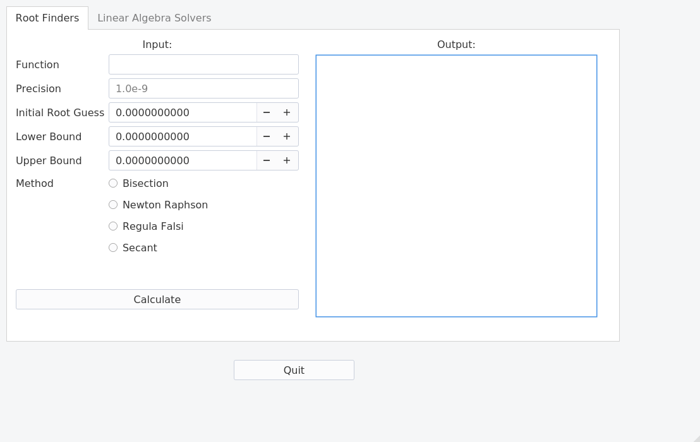
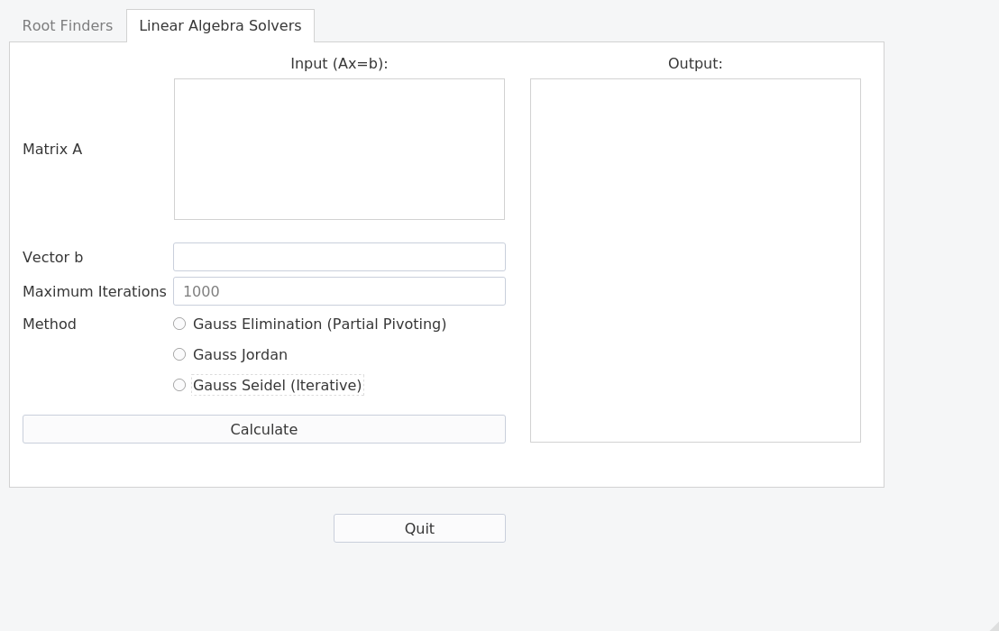

# pyQtNumSim  

> Copyright (C) 2017  Rohit Goswami

pyQtNumSim is an attempt to ease the burden of undergraduate B.Tech coursework, and maybe even foster interest.

## TO-DO

- Check Secant
- Add Max Iterations for secant
- Hide and enable UI elements per method
- Use Naive Gauss Elimination Again
- Unbreak pivoting for Gauss Jordan
- Show steps for everything
- Plot 

## Methods Covered
The methods (modules) are:
1. Root Finding

* Bisection
* Newton Raphson
* Regula Falsi
* Secant

2. Simultaneous Linear Equations

* Gauss Seidel
* Gauss Jordan
* Gauss Elimination (Naive + Pivoting)
    
3. ODE

* Milne's Method
* Runge-Kutta - I (Euler)
* Runge-Kutta - II
* Runge-Kutta - III
* Runge-Kutta - IV

## Acknowledgments
This software is built on the following (incomplete):

- [PyQt 5](https://www.riverbankcomputing.com/software/pyqt/download5)
- [Python 3](https://www.python.org)
- [Qt Designer](doc.qt.io/qt-5/qtdesigner-manual.html)
- [PyInstaller](www.pyinstaller.org/)
- [SymPy](http://www.sympy.org/)

Additionally the following books and resources have been used (also mentioned in-code):

- Summerfield, M. (2007). Rapid GUI programming with Python and Qt: the definitive guide to PyQt programming. Pearson Education.
- Kiusalaas, J. (2013). Numerical methods in engineering with Python 3. Cambridge university press.
- [Tales of the DevOps](https://devopslog.wordpress.com/2012/12/23/newton-raphson-method-using-python-sympy/) 

## Contributions
Pull requests welcome!
Please add yourself to the Contributors file as well, with a summary and contact details (optinal).

## License
The code itself is under the [GNU AGPLv3](https://choosealicense.com/licenses/agpl-3.0/) however it is built with PyQt, so as per [this](https://opensource.stackexchange.com/questions/5383/under-what-licenses-can-i-release-open-source-software-that-uses-pyqt) StackExchange thread, the PyQT portion is under the [GNU GPLv3](https://choosealicense.com/licenses/gpl-3.0/).
